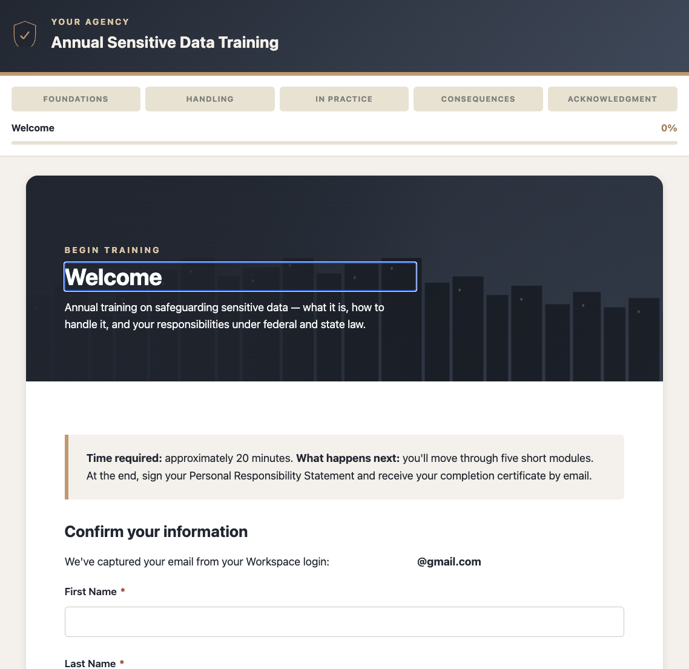

# Sensitive Data Training Platform

**A complete, audit-ready security awareness training built entirely in Google Workspace.**

Replace your annual PowerPoint compliance training with an interactive web app that tracks completion, generates PDF certificates, emails confirmations, and produces the audit evidence your compliance frameworks require — all without leaving Google Workspace and without standing up new infrastructure.



---

## The problem

Most agencies handle annual security awareness training the same way: a slide deck attached to an email, a sign-in sheet (or worse, a shared Google Sheet where people add their name), and an inbox full of replies that "I completed it." This satisfies nobody:

- **Auditors** can't verify who actually read the material vs. who just clicked through
- **Information security teams** have no central record of who's current and who's overdue
- **Employees** get a slide deck that reads like a legal disclaimer and forget it within a week
- **Frameworks like IRS Pub 1075, CMS ARC-AMPE, HIPAA, and state privacy laws** have specific Awareness & Training (AT) control requirements that slide-deck training meets only on paper

For agencies handling Federal Tax Information (FTI), Protected Health Information (PHI), Social Security Administration (SSA) data, and Personally Identifiable Information (PII), this gap is a real audit finding waiting to happen.

## The solution

A web-based interactive training that:

- **Walks users through 5 modules and 29 steps** of structured content covering data privacy fundamentals, sensitive data categories, daily handling practices, consequences of mishandling, and a signed Personal Responsibility Statement
- **Captures identity automatically** via Google Workspace SSO — no separate sign-up, no email-collection form to fill out fraudulently
- **Generates a PDF certificate** at completion, archived to Drive and emailed to the user
- **Logs every completion to a tracker spreadsheet** with timestamp, user identity, role, sensitive-data flags, supervisor email, and certificate URL
- **Calculates next-due dates and status** ("Current" / "Due Soon" / "Overdue") via spreadsheet formulas, ready for supervisor escalation workflows
- **Distributes via a Google Site** with a clean internal URL (`sites.google.com/your-domain/training`) that surfaces the training behind a branded landing page — the friendly front door that gets emailed to staff, embedded in onboarding, and added to the intranet
- **Automates the recertification cycle end-to-end** — once deployed, the system continuously tracks who's current, surfaces who's overdue, and (with the optional automation triggers) emails reminders and escalates to supervisors without manual intervention from the security team
- **Renders cleanly on desktop and mobile** with no infrastructure beyond Google Workspace

Built as a deployable Apps Script web app embedded in a Google Site for distribution.

---

## Architecture

```
┌─────────────────────────────────────────────────────────────────┐
│                                                                  │
│   USER                                                           │
│    │                                                             │
│    ▼                                                             │
│   Google Site (landing page)                                     │
│    │                                                             │
│    │  Single-sign-on via Google Workspace                        │
│    ▼                                                             │
│   Apps Script Web App  ──────►  Index.html (29-step training)    │
│    │                                                             │
│    ├─►  Identity capture (Session.getActiveUser)                 │
│    │                                                             │
│    ├─►  Form submission                                          │
│    │       │                                                     │
│    │       ├─►  Google Sheet (tracker)         18 columns        │
│    │       │       ├─ next-due formula                           │
│    │       │       └─ status formula                             │
│    │       │                                                     │
│    │       ├─►  Drive folder (cert archive)    PDF per user      │
│    │       │                                                     │
│    │       └─►  MailApp (confirmation email)   PDF attached      │
│    │                                                             │
│    └─►  Returns confirmation page with cert link                 │
│                                                                  │
└─────────────────────────────────────────────────────────────────┘
```

**Why Google Workspace?** Three reasons:

1. **Identity is solved.** Workspace SSO means every completion is verifiably tied to a real, current employee. No sign-up forms to spoof, no email validation needed.
2. **No new infrastructure to manage.** Sheets is the database. Drive is the file store. MailApp is the SMTP server. Sites is the CDN. Everything inherits the agency's existing access controls, retention policies, and disaster recovery.
3. **Auditors already trust it.** Workspace logs are admissible. Drive retention is documented. Apps Script execution is traceable.

The whole system uses zero external services. No AWS account. No third-party SaaS subscription. No vendor relationship to procure or renew.

---

## Distribution — getting it in front of staff

The deployed Apps Script web app has a URL like `https://script.google.com/macros/s/AKfyc.../exec` — functional but ugly, hard to remember, and easy for staff to mistake for a phishing link. Not the kind of URL you put in an all-staff email.

The deployment pattern that works:

1. **Stand up a Google Site** as a branded landing page (`sites.google.com/your-domain/training-name`)
2. **Add intro context on the Site** — what the training covers, who needs to take it, how long it takes, who to contact for help
3. **Surface the training behind a "Start Training" button** that opens the Apps Script web app in a new tab
4. **Restrict the Site** to your Workspace domain so only authenticated employees can reach it
5. **Distribute the friendly Site URL** via email, intranet, onboarding documents, and recurring annual reminders

The Site becomes the canonical front door. The Apps Script URL is implementation detail. If you ever migrate the training to a different platform, the Site URL stays the same — you just update where the button points.

A pre-built brandable landing page template can accompany this repo (a self-contained HTML file) — drop it into the Site as embed code, customize the agency name and contact, and the Site is live in under 10 minutes.

> **Note on iframe embedding:** Google Sites *can* iframe-embed the Apps Script web app directly, but the iframe height is constrained and the training gets cut off. The link/button approach is strongly recommended over the iframe approach.

---

## Automation — the recertification flywheel

The tracker is more than a log of who finished. It's the backbone of an end-to-end recertification system that the security team doesn't have to manually drive.

### What's automated out of the box

- **Status calculation.** Every completion gets a `Next Due` date (Training Date + 365 days) and a `Status` (Current / Due Soon / Overdue) calculated by spreadsheet `ARRAYFORMULA`. New rows pick up status automatically.
- **Conditional formatting.** Red for Overdue, yellow for Due Soon, green for Current — the security team gets an at-a-glance compliance dashboard the moment the sheet opens.
- **Identity-linked records.** Because identity comes from Workspace SSO, the tracker has no fake or duplicate entries. Every row is tied to a real, currently-active employee.
- **Versioned completions.** Each row records the training version at completion time, so when content changes you can audit-trail "who completed v2026.1 vs v2026.2."

### What's automatable with optional triggers (1-2 hours each to add)

These are time-based Apps Script triggers that scan the tracker on a schedule. The hooks for each are present in `Code.gs`; turning them on is a matter of writing the trigger function and scheduling it.

- **Reminder emails.** Daily scan at 6am. Email each user at 30, 14, 7, and 1 days before their `Next Due` date. Subject line, body, and recertification link all parameterized.
- **Supervisor escalation.** When a user goes more than 7 days overdue, email their supervisor (column H of the tracker) with the user's name, role, original due date, and a link to the training. Re-send weekly until completion.
- **Quarterly status reports.** First Monday of each quarter, email the security team a summary: completion rate by department, list of overdue staff, list of new hires not yet trained, average time-to-completion.
- **Weekly tracker backup.** Sunday at midnight, copy the tracker sheet to a `Backups/YYYY-MM-DD/` Drive folder. Audit insurance against accidental deletion or corruption.
- **"Check my status" self-service page.** A second Apps Script web app where users enter their email and see their last completion date, next due date, and certificate link. Removes "did I take this yet?" tickets from the security team's queue.

### Why this matters

Without automation, the tracker is just a spreadsheet — useful but reactive. The security team has to manually open it, sort by due date, and chase people. That's exactly the manual labor that gets dropped when the team is busy, and exactly what auditors look for when they're testing whether AT controls are continuously enforced or just paper.

With automation, the system runs itself. The security team's only manual touch is reviewing the quarterly report and following up on edge cases (people who've left the agency, contractors mid-onboarding, etc.). Compliance becomes a steady-state operation rather than a quarterly fire drill.

---

## Compliance frameworks supported

The training content is structured to satisfy AT (Awareness & Training) control requirements in:

- **IRS Publication 1075** — including the AT-3 control for privileged users with FTI access (DBAs, system administrators, developers)
- **CMS ARC-AMPE** — annual security awareness training requirements for state agencies handling Medicaid data
- **HIPAA Security Rule** — § 164.308(a)(5) workforce training and awareness
- **State privacy laws** (e.g., the Privacy Act of 1974 at the federal level; state-specific state privacy act equivalents)
- **Internal Revenue Code §§ 6103, 7213, 7213A, 7431** — disclosure prohibitions and personal liability

The Personal Responsibility Statement (PRS) at the end of training references each of these frameworks explicitly, creating an auditable record that the user was advised of their obligations under each.

---

## Methodology — turning source materials into structured training

One of the harder parts of building compliance training is turning long-form source materials (IRS publications, CMS handbooks, state law, agency policy documents, recorded webinars) into something a non-specialist can absorb in 20 minutes.

The approach used here:

1. **Bulk source ingestion.** Source materials in PDF, DOCX, and recorded video formats were processed with **Readwise Reader** to transcribe video to text and surface highlighted passages.
2. **Key-point extraction.** LLM-assisted extraction pulled the key compliance points from each source — the specific control, the actionable behavior it requires, and the consequence of non-compliance.
3. **Mapping to the audience.** Each extracted point was tagged by audience (all-staff, privileged users, contractors, supervisors). This drove the module structure.
4. **Scenario generation.** Real-world scenarios were drafted from documented incidents and case law to make abstract requirements concrete.
5. **Iterative review.** Information security stakeholders reviewed each module for accuracy, completeness, and alignment with their specific controls.

This methodology turns weeks of manual content development into days, and the resulting training is more accurate than a generic vendor-supplied module because it reflects the specific frameworks and policies the agency is actually subject to.

---

## Content pipeline — adapt your existing training in minutes

Most agencies don't start with a blank page — they have an existing PowerPoint deck or Word doc that's been the annual training for years. The repo includes a content pipeline that extracts structured content from PDF, DOCX, and PPTX sources and produces a review-ready draft mapped to the 5-module training format.

```bash
# Step 1: Extract structured content from your source
python3 tools/extract_content.py existing_training.pptx -o content.json

# Step 2: Generate a categorized review draft
python3 tools/draft_training.py content.json -o draft.md
```

What you get:
- **A JSON content tree** with headings, body text, bullets, and (for PPTX) speaker notes — preserving page/slide numbers so you can cross-reference
- **A Markdown review draft** that auto-categorizes each source section into Foundations / Handling / In Practice / Consequences / Acknowledgment using keyword matching
- **Detected legal references** (IRC sections, HIPAA, NIST, FERPA, CJIS, etc.) so you can verify the Personal Responsibility Statement cites the right frameworks
- **A review checklist** that flags what still needs editorial decisions (scenarios to write, content to verify, agency-specific procedures to add)

The pipeline does the structural work — extraction, categorization, reference detection — and leaves editorial judgment with you and your information security team. That's deliberate: compliance content needs human review, and the goal is to compress weeks of copy-paste into hours of review, not to fully automate content creation.

**Working examples:** `tools/test_samples/` includes a sample PDF, DOCX, and PPTX with their extracted JSON and generated drafts so you can see the pipeline output without running it yourself first.

See `docs/CONTENT_PIPELINE.md` for the full workflow.

---

## What's included

```
sensitive-data-training/
├── apps_script/
│   ├── Code.gs                  Server-side: form handling, certificate generation, email
│   ├── Automation.gs            Optional time-based triggers (reminders, escalation, reports, backups)
│   ├── Index.html               29-step training UI (generated)
│   ├── Stylesheet.html          All CSS (cream/tan/navy palette, custom design system)
│   ├── JavaScript.html          Client-side: navigation, validation, form submission
│   └── _build_index.py          Build script that generates Index.html from content
├── tools/
│   ├── extract_content.py       PDF/DOCX/PPTX → structured JSON
│   ├── draft_training.py        JSON → categorized Markdown draft for review
│   └── test_samples/            Working examples: sample sources + extracted outputs
├── docs/
│   ├── CONFIG.md                What to edit to brand for your agency
│   ├── DEPLOYMENT.md            Step-by-step Apps Script + Sites deployment
│   ├── SHEET_SCHEMA.md          The 18-column tracker schema with formulas
│   ├── CONTENT_GUIDE.md         How to adapt content for different compliance frameworks
│   ├── CONTENT_PIPELINE.md      Full workflow for the extraction + drafting pipeline
│   └── LINKEDIN_POST.md         Two LinkedIn post drafts for repo announcement
├── assets/
│   └── screenshots/             UI screenshots for reference
├── LICENSE
└── README.md                    This file
```

---

## Setup (~30 minutes)

### 1. Create the Drive structure

Create the following folders in Google Drive (any naming you prefer):

- `01_Current_Materials` — current training assets
- `02_Tracker` — the bound spreadsheet
- `02_Tracker/Certificates` — the PDF archive folder
- `03_Archive` — old training versions
- `06_Audit_Evidence` — exports for auditors
- `07_Governance` — policies and procedures

### 2. Create the tracker spreadsheet

Create a new Google Sheet inside `02_Tracker`. Name it "Training Tracker" or similar. See `docs/SHEET_SCHEMA.md` for the 18-column header layout and the two formula columns (`Next Due`, `Status`).

### 3. Create the Apps Script project

From the tracker sheet: **Extensions → Apps Script**. This creates a sheet-bound Apps Script project.

Paste the four files into the Apps Script editor:
- `Code.gs` (replace the default `Code.gs`)
- `Index.html` (new file)
- `Stylesheet.html` (new file)
- `JavaScript.html` (new file)

### 4. Configure for your agency

Open `Code.gs` and edit the `CONFIG` block at the top:

```javascript
const CONFIG = {
  AGENCY_NAME: 'Your Agency Name Here',
  TRAINING_VERSION: '2026.1',
  RECERTIFICATION_DAYS: 365,
  SECURITY_CONTACT: 'security@your-agency.gov',
  CERTIFICATES_FOLDER_ID: 'PASTE_DRIVE_FOLDER_ID_HERE',
  CERTIFICATE_SIGNATURE_LINE: 'Information Security Office',
  ISSUING_AUTHORITY: 'Information Security Office'
};
```

For UI text changes (agency name in headers, hero copy, etc.), edit the `CONFIG` block at the top of `_build_index.py` and re-run `python3 _build_index.py` to regenerate `Index.html`. See `docs/CONFIG.md` for the full list of editable values.

### 5. Test certificate generation

In the Apps Script editor, run the `testCertificateGeneration` function. This generates a test certificate and emails it to you, without writing to the tracker. Confirm the certificate looks right before going live.

### 6. Deploy as a web app

In Apps Script: **Deploy → New deployment → Web app**.

- **Execute as:** User accessing the web app
- **Who has access:** Anyone within [your organization]

Copy the deployed URL (ends in `/exec`).

### 7. (Optional) Wrap in a Google Site

Create a Google Site as a friendly landing page for the training. Embed the deployed URL or link to it from a "Start Training" button. See `docs/DEPLOYMENT.md` for the full Sites setup.

---

## Customization

Three layers of customization, in order of complexity:

### Layer 1: Branding (5 minutes)
Change agency name, contact email, recertification cycle. Edit `CONFIG` blocks in `Code.gs` and `_build_index.py`. Done.

### Layer 2: Content (a few hours)
Modify modules, sections, scenarios, and the PRS. Edit `_build_index.py` directly — content is structured Python strings. Re-run the build script to regenerate `Index.html`.

See `docs/CONTENT_GUIDE.md` for tips on content adaptation, including:
- Adapting scenarios to your agency's data types
- Adding or removing sections within modules
- Customizing the PRS to reference your specific compliance frameworks

### Layer 3: Architecture (varies)
Change the tracker schema, add new automated triggers (e.g., reminder emails before recertification deadlines), integrate with HR systems for supervisor-overdue escalation, etc.

---

## Beyond the core

The core training + tracking + distribution system is what's in this repo. Adjacent capabilities that are easy 1-2 hour additions on the same Apps Script + Sheets foundation:

- **Multi-language content.** Render the training UI in Spanish, French, etc. by adding a language toggle and translation lookup table. The page structure is already separated from copy.
- **Role-based content.** Show or skip specific modules based on whether the user flagged "FTI access: yes" — privileged users see additional sections; general staff see a shorter version.
- **Pre-test / post-test analytics.** Add a 5-question knowledge check before and after to measure learning gains, captured in a separate sheet tab.
- **Integration with HR systems.** Pull supervisor email automatically from Workday/BambooHR/etc. via API rather than asking the user to enter it.

Each is a natural extension of the existing pattern. The architecture doesn't need to change.

---

## License

MIT. Use it, fork it, adapt it for your agency. If you do, consider sharing back what you learned — security awareness training is a problem every agency has and the templates available today are mostly bad.

---

## A note on this template

This template is derived from a production deployment serving a state agency handling FTI, PHI, SSA, and PII data under multiple federal frameworks. Agency-specific branding, content, and configuration have been generalized for public release. The architecture, content structure, and compliance framework alignment reflect real production decisions, not theoretical ones.
